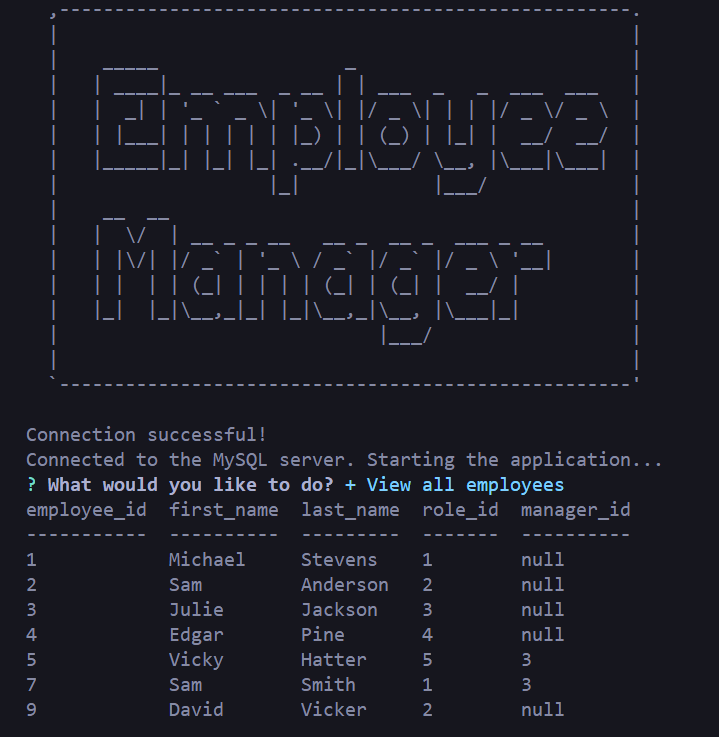

# Employee Tracker 🚀
📊 A command-line application to manage a company's employee database, using Node.js, Inquirer, and MySQL.

### Features
- View all departments, roles, and employees 📑
- Add departments, roles, and employees ➕
- Update employee roles 🔁
- Delete departments, roles, and employees ❌

## Installation
1. Clone the repository to your local machine.
2. Navigate to the cloned directory.
3. Install the necessary dependencies with `npm install`.

## Usage
To start the application, run the following command in your terminal:
```node index.js```

Follow the on-screen prompts to interact with the database. 🖥️

## Database Setup
1. Ensure MySQL is installed on your system.
2. Log into your MySQL shell and create a new database called `employee_tracker`.
3. Use the `schema.sql` file in the `db` folder to create your database schema.
4. (Optional) Use the `seeds.sql` file to populate your database with initial data.

## Technologies Used
- Node.js
- MySQL
- Inquirer.js

## Screenshots



(or watch on YouTube [here](https://www.youtube.com/watch?v=toyku6rvMwM))

## License
This project is licensed under the MIT License.

---

Happy Managing! 🎉